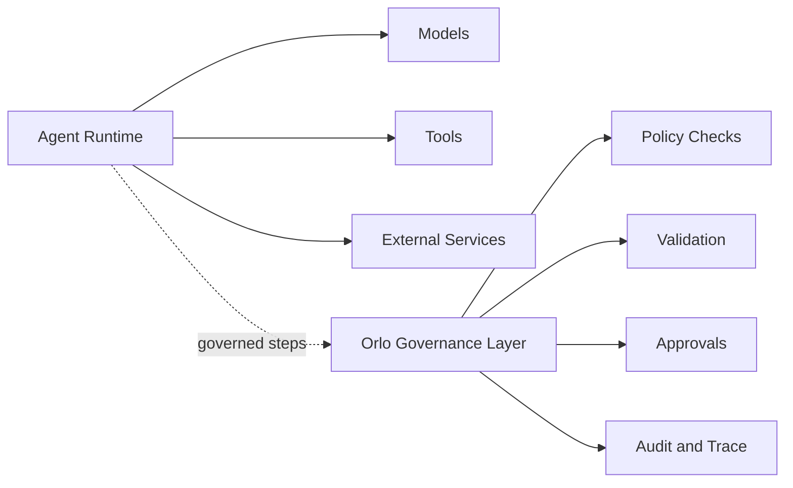

# Agent Governance Position

Orlo does not own the agent runtime. It governs consequential steps around it.

## What this shows

- the agent runtime still plans and executes
- Orlo governs meaningful step boundaries
- governance covers policy, validation, approvals, and auditability

## Why this matters

This shows Orlo’s role in an agentic system:

- not a workflow runtime
- not a general-purpose agent orchestrator
- a governance and control layer for production AI behavior
