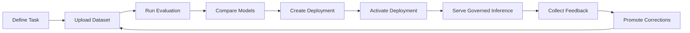

# Evaluation to Deployment Loop

This is the core product loop behind Orlo Platform.

## What this shows

- Orlo is designed as a closed improvement loop, not just a single inference endpoint
- evaluation informs deployment
- feedback and promotion feed future dataset versions

## Why it matters

It shows how Orlo turns evaluation, deployment, inference, and feedback into a continuous improvement loop.
