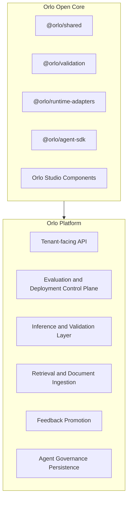

# Open Core vs Platform

This diagram shows the high-level relationship between Open Core and Orlo Platform.

## What this shows

- Open Core provides reusable packages and UI surfaces.
- Orlo Platform is the managed system that turns those primitives into a multi-tenant governed product.
- The public packages are designed to complement the platform, not replace the full control plane.
