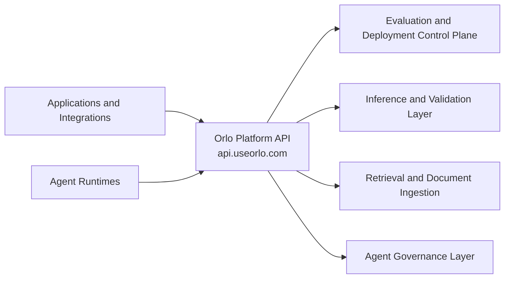

# Platform Request Flow

This diagram shows the public request boundary for Orlo Platform.

```mermaid
flowchart LR
    A["Applications and Integrations"] --> C["Orlo Platform API<br/>api.useorlo.com"]
    B["Agent Runtimes"] --> C

    C --> D["Evaluation and Deployment Control Plane"]
    C --> E["Inference and Validation Layer"]
    C --> F["Retrieval and Document Ingestion"]
    C --> H["Agent Governance Layer"]
```

## What this shows

- Orlo routes each request into the appropriate platform capability
