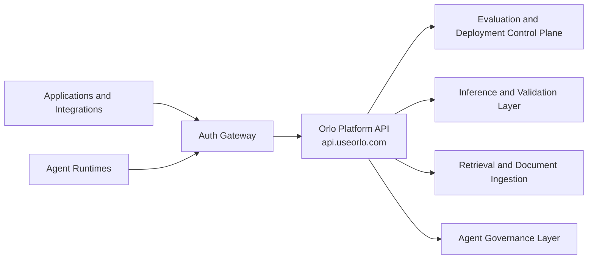

# Platform Request Flow

This diagram shows the public request boundary for Orlo Platform.

## What this shows

- callers integrate through the gateway in front of `api.useorlo.com`
- Orlo relies on trusted upstream auth and org context
- Orlo then routes the request into the appropriate control-plane capability

## What this intentionally omits

- admin and internal-only routes
- queue names and worker topology
- persistence internals
- provider-specific routing internals

